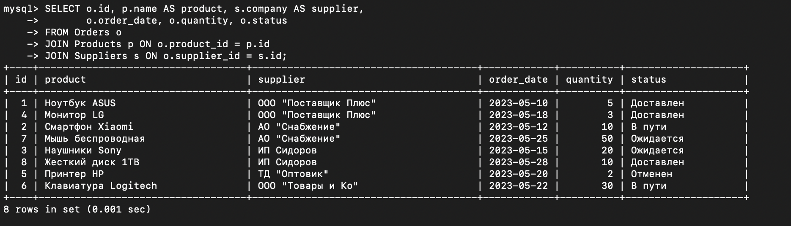
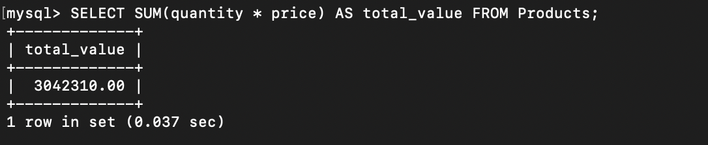

# Лабораторная работа № 14
## Задания
1. Спроектировать БД с использованием crow’s foot notation.
2. Создать таблицы БД и заполнить данными. Для генерации данных можно использовать сервис https://www.mockaroo.com/.
3. Написать несколько запросов для выборки данных из всех таблиц.
4. Оформить отчёт в README.md.
   
## Вариант 4
База данных складского учета:

Таблица Товары с информацией о товарах на складе, такой как наименование, количество и цена.

Таблица Поставщики с информацией о поставщиках товаров, например, название компании и контактная информация.

Таблица Заказы с информацией о заказах у поставщиков, такой как дата заказа, количество и статус.
### Ход работы и решение 

## 1. ER-диаграмма 

## 2. Создание таблиц и заполнение данными

## 3. Несколько запросов для выборки данных из всех таблиц 

### Показать таблицы. Получить список всех товаров; получить список поставщиков с их контактной информацией:

### Получить все заказы с информацией о товаре и поставщике:

### Получить товары, количество которых меньше 10:

### Получить общую стоимость всех товаров на складе:

### Получить количество заказов по каждому поставщику:

### Получить заказы, которые еще не доставлены:

