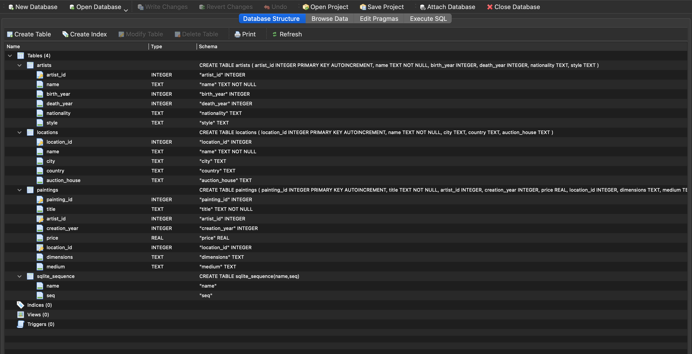

# Лабораторная работа 15
## Задания 
1. Спроектируйте БД с использованием crow’s foot notation.
2. Реализуйте парсер для сбора данных с веб-страницы.
3. С помощью DB API cоздайте таблицы БД и заполните их данными, полученными с помощью парсера.
4. Напишите запросы для выборки данных из БД.

## Вариант 4
Список самых дорогих картин.

#### Таблицы:
картины

художники

места продаж

#### Запросы:
топ N художников по числу картин

топ N художников по цене картин

самые дорогие картины по годам

суммарная стоимость топ N самых дорогих картин

## Содержание работы
1. Создание базы данных expensive_paintings.db, содержащей информацию о самых дорогих картинах мира, их авторах и местах продаж, с последующим анализом данных.
2. Методы и инструменты:
-Парсинг данных с Wikipedia (библиотеки requests, BeautifulSoup).
-Обработка и сохранение данных в SQLite.
-Анализ с помощью SQL-запросов.

3.Полученные результаты

 

