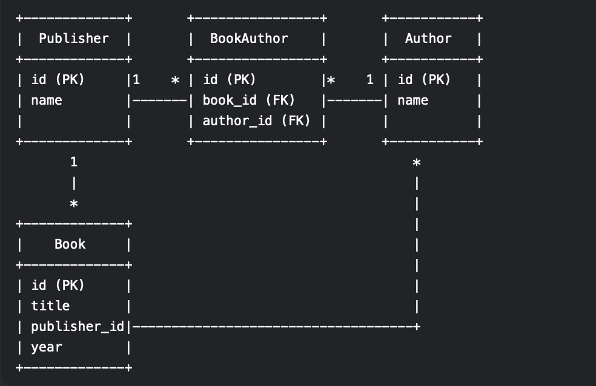
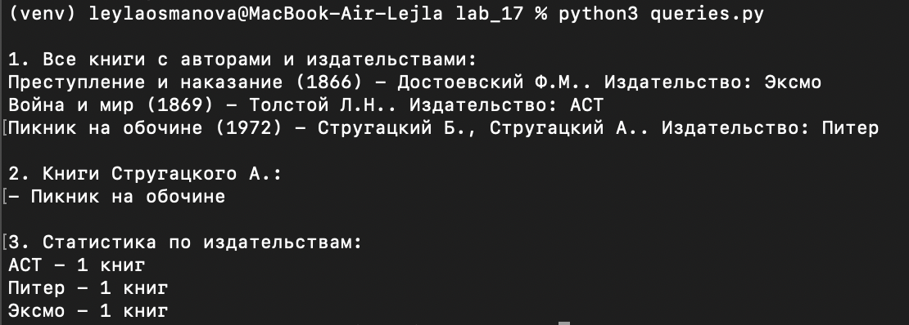
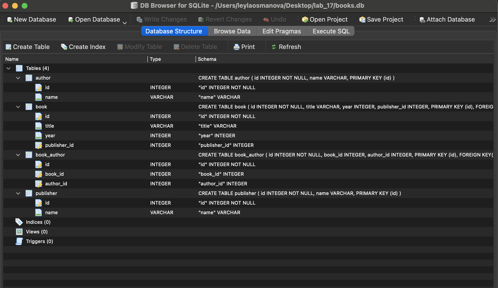
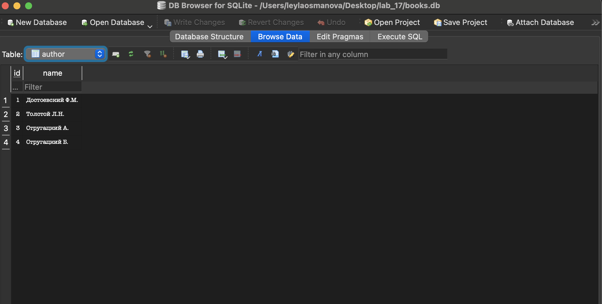

# Лабораторная работа №17 
## Задание 
1) Спроектируйте БД с использованием ```crow’s foot notation```.
2) Напишите модели данных, создайте и заполните БД с помощью ```SQLAlchemy```.
3) Напишите запросы для выборки и анализа данных из БД.
4) Оформите отчёт в README.md. Отчёт должен содержать:
    - Условия задач
    - Описание проделанной работы
    - Скриншоты результатов
    - Ссылки на используемые материалы
## Вариант 4
Книги. Каждая книга издаётся одним издательством, но у неё может быть несколько авторов.
## Ход работы








